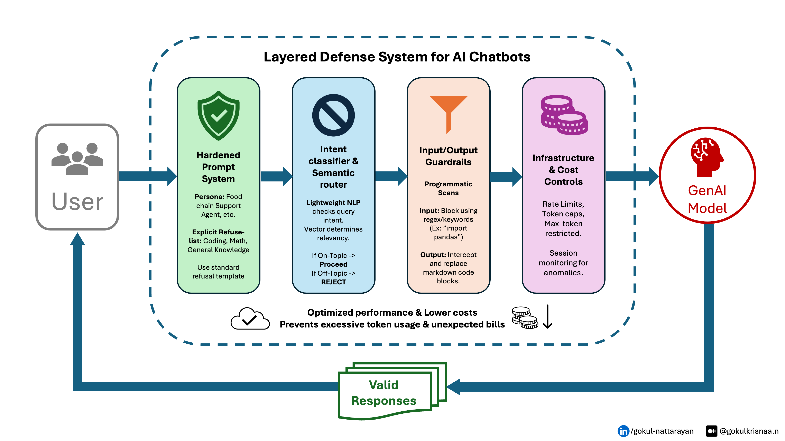

# 🤖 Knowledge Retrieval AI Chatbot — with a Layered Defense System

A RAG (Retrieval-Augmented Generation) chatbot that reads a knowledge document and answers questions about it — **hardened against LLMjacking / LLM-freeloading abuse** with a four-layer defense-in-depth system. Built with Python, LangChain, and Gemini; deployed on Microsoft Azure App Service.

> Started as a week-one cloud-deployment exercise (no Docker, no prior deployment experience) and grew into a study of **defending a production LLM app against token-draining abuse** — keeping a single-purpose support bot from being hijacked into a free, general-purpose code/compute engine.

---

## 🚀 Live Demo

🔗 **[resume-content-retriever-aichatbot.azurewebsites.net](http://resume-content-retriever-aichatbot.azurewebsites.net)**

---

## 🛡️ The Problem: LLMjacking / LLM-Freeloading

A public AI support chatbot is backed by a metered, pay-per-token LLM. Nothing stops a user from ignoring its purpose and asking it to *"debug this Python script"* or *"solve this math problem."* Each off-topic request:

- consumes expensive tokens the owner pays for,
- drives up the monthly bill with zero business value, and
- effectively turns your support bot into a **free general-purpose AI for strangers.**

A hardened system prompt alone is not enough — it still incurs the full cost of a generation call *before* it can refuse. This project implements a layered defense that blocks abusive requests **as early and as cheaply as possible**, ideally before a single billable token is spent.

---

## 🧱 Layered Defense System



Four independent layers sit between the user and the LLM. A request must clear every layer to reach generation; the first layer to object returns a single, consistent refusal message.

| # | Layer | Mechanism | Cost to run | What it stops |
|---|---|---|---|---|
| **1** | Hardened Prompt System | Strict persona + explicit refuse-list baked into the system prompt | Paid (part of generation) | Off-topic requests that slipped past earlier gates |
| **2** | Intent Classifier / Semantic Router | FAISS distance check of the query against the knowledge base | Cheap (1 embedding + local search) | Off-topic queries — *before* any generation call |
| **3** | Input / Output Guardrails | Regex/keyword scan on input; code-block scrub on output | Free (stdlib `re`) | Code & computation requests; stray code in output |
| **4** | Infrastructure & Cost Controls | Per-IP rate limits + capped `max_output_tokens` | Free / config | Request floods & runaway generations |

### The key design decision: execution order ≠ diagram order

The diagram reads left-to-right as defense-in-depth, but the **execution order is sorted by cost** so the cheapest gates fire first and the expensive generation call is the last thing a request can reach:

```
                                  ┌─ free ─┐ ┌── cheap ──┐ ┌──────── paid ────────┐
User → [rate limit] → [input regex scan] → [FAISS relevance gate] → [hardened-prompt generation, capped tokens] → [output scrub] → User
        Layer 4a          Layer 3a               Layer 2                      Layer 1 + 4b                          Layer 3b
```

Two consequences worth noting:

- **The hardened prompt is the *last* cost gate, not the first.** It only takes effect *during* a paid generation call, so it's a correctness net — not a money-saver. The free regex scan and the cheap semantic gate are what actually prevent token spend.
- **The "intent classifier" is free — it reuses the FAISS index you already built.** An off-topic query (coding, math, trivia) lands semantically far from every chunk of the knowledge base, so a simple distance threshold gates it out with no new model and no new dependency.

---

## 🧠 How It Works

```
User Question
   → Flask route
   → Layer 4a  Rate limit (per IP)
   → Layer 3a  Input regex scan        (blocks "import pandas", "def foo()", etc.)
   → Layer 2   FAISS relevance gate    (off-topic → refuse, no LLM call)
   → Layer 1   Hardened-prompt generation via Gemini 2.5 Flash (max_output_tokens capped)
   → Layer 3b  Output scrub            (strip any stray code blocks)
   → Answer
```

The underlying RAG pipeline:

1. **Document Loading** — reads `knowledge.txt` on startup
2. **Chunking** — splits text into 500-character overlapping chunks
3. **Embedding** — converts chunks to vectors with `gemini-embedding-001`
4. **Retrieval** — FAISS finds the 3 most relevant chunks (and their distances)
5. **Gating** — the nearest-chunk distance decides whether the query is on-topic
6. **Generation** — Gemini 2.5 Flash answers from the retrieved chunks, under a strict persona

---

## 🛠️ Tech Stack

| Layer | Technology |
|---|---|
| Language | Python 3.11 |
| Web Framework | Flask |
| AI Orchestration | LangChain |
| Vector Store | FAISS (in-memory) — also powers the Layer-2 semantic gate |
| LLM | Gemini 2.5 Flash (`thinking_budget=0`) |
| Embeddings | `gemini-embedding-001` |
| Rate Limiting | Flask-Limiter |
| Production Server | Gunicorn |
| Cloud Hosting | Microsoft Azure App Service (Free F1 tier) |

> The entire defense system adds **one** dependency (`flask-limiter`). Layers 1–3 reuse what the RAG app already has.

---

## 📁 Project Structure

```
chatbot/
├── app.py            # Flask routes + RAG pipeline; wires the 4 layers in cost order
├── guard.py          # Defense pipeline: input scan, semantic gate, output scrub, logging
├── config.py         # All thresholds, limits, persona, and blocklist in one place
├── calibrate.py      # One-off script to tune the Layer-2 distance threshold
├── knowledge.txt     # The knowledge document (customize this!)
├── requirements.txt  # Python dependencies (+ flask-limiter)
├── assets/
│   └── layered-defense-architecture.png
├── .gitignore
└── README.md         # You are here
```

---

## ⚙️ Run Locally

### 1. Clone the repository
```bash
git clone https://github.com/gokulkrisnaa-n/resume-content-retriever-chatbot.git
cd resume-content-retriever-chatbot
```

### 2. Create and activate a virtual environment
```bash
# Windows
python -m venv venv
venv\Scripts\activate

# Mac / Linux
python3 -m venv venv
source venv/bin/activate
```

### 3. Install dependencies
```bash
pip install -r requirements.txt
```

### 4. Set your Gemini API key
Get a key from [Google AI Studio](https://aistudio.google.com/apikey), then:
```bash
# Windows
set GEMINI_API_KEY=your-gemini-api-key-here

# Mac / Linux
export GEMINI_API_KEY=your-gemini-api-key-here
```

### 5. Customize the knowledge base
Edit `knowledge.txt` with any content you want the chatbot to know about — a resume, product docs, company FAQs, research notes, anything.

### 6. Calibrate the semantic gate (important)
The Layer-2 distance threshold depends on *your* content, so measure it instead of guessing:
```bash
python calibrate.py
```
This prints nearest-chunk distances for known on-topic vs. off-topic queries and suggests a `MAX_DISTANCE`. Paste that value into `config.py`.

### 7. Run the app
```bash
python app.py
```
Visit **http://localhost:8000**.

---

## 🎛️ Configuring & Tuning the Defense

All knobs live in `config.py`:

| Setting | Controls | Notes |
|---|---|---|
| `MAX_DISTANCE` | Layer 2 sensitivity | **Calibrate per knowledge base.** Lower = stricter. |
| `BLOCKLIST_PATTERNS` | Layer 3a input scan | Regex for code/SQL/markdown patterns. |
| `MAX_INPUT_CHARS` | Layer 3a length gate | Rejects over-long inputs before embedding. |
| `MAX_OUTPUT_TOKENS` | Layer 4 generation cap | Sized to fit a real answer, not artificially tiny. |
| `RATE_LIMIT` / `DAILY_LIMIT` | Layer 4 rate limits | Per-IP (Flask-Limiter syntax). |
| `PERSONA_NAME` / `ALLOWED_DOMAIN` / `REFUSAL_MESSAGE` | Layer 1 prompt | Defines scope and the single user-facing refusal. |

> **Tip:** keep one shared `REFUSAL_MESSAGE` so an attacker can't fingerprint which layer caught them.

---

## ☁️ Deploy to Azure (Free Tier)

### Prerequisites
- Azure account (free or pay-as-you-go)
- [Azure CLI](https://aka.ms/installazurecliwindows) installed

### Quick deploy commands
```bash
# 1. Login
az login

# 2. Create resource group
az group create --name chatbot-rg --location eastus

# 3. Create free App Service plan
az appservice plan create --name chatbot-plan --resource-group chatbot-rg --sku F1 --is-linux

# 4. Create web app (replace YOUR-UNIQUE-NAME)
az webapp create --name YOUR-UNIQUE-NAME --resource-group chatbot-rg --plan chatbot-plan --runtime "PYTHON:3.11"

# 5. Set your API key securely
az webapp config appsettings set --name YOUR-UNIQUE-NAME --resource-group chatbot-rg --settings GEMINI_API_KEY="your-gemini-api-key-here"

# 6. Zip and deploy (include the new defense files!)
zip deploy.zip app.py guard.py config.py requirements.txt knowledge.txt
az webapp deploy --name YOUR-UNIQUE-NAME --resource-group chatbot-rg --src-path deploy.zip --type zip

# 7. Set startup command
az webapp config set --name YOUR-UNIQUE-NAME --resource-group chatbot-rg --startup-file "gunicorn --bind=0.0.0.0:8000 app:app --timeout 120"

# 8. Restart
az webapp restart --name YOUR-UNIQUE-NAME --resource-group chatbot-rg
```

**Cost:** Azure F1 tier = **$0**. Gemini API for casual testing = **~$0.01**.

> **Note on rate limiting at scale:** Flask-Limiter's default store is in-memory and per-worker. That's fine on the single-worker F1 tier; when you scale out to multiple workers/instances, point it at Redis via `storage_uri` so limits aggregate correctly.

---

## 💡 Customization

- **Change the knowledge source:** replace `knowledge.txt` with anything — a product manual, your resume, company policies, research papers. Re-run `calibrate.py` afterward.
- **Adjust retrieval sensitivity:** change `k=3` in `app.py` to retrieve more or fewer chunks.
- **Tighten or relax the defense:** edit thresholds and patterns in `config.py`.

---

## 📌 Lessons Learned

- **A hardened prompt is your *last* line of defense against cost, not your first.** It only refuses after you've already paid for a generation call. Cheap, local gates (regex + vector distance) are what actually save tokens.
- **Your vector store is a free intent classifier.** Off-topic queries sit far from every knowledge chunk, so FAISS distance gates them out with no extra model.
- **Gemini 2.5 Flash is a reasoning model, and thinking tokens count against `max_output_tokens`.** A low cap made legit answers truncate mid-sentence because internal "thinking" ate the budget. Setting `thinking_budget=0` fixed it — and made every answer faster *and* cheaper.
- **Order your defenses by cost.** Fail fast and free before you fail slow and paid.
- Environment variables are the right way to handle API keys — never hardcode them.
- Azure App Service F1 is a perfect zero-cost sandbox for learning cloud deployment.

---

## 👤 Author

**Gokul Krisnaa Nattarayan**
MS Data Science, University of Houston – Clear Lake

[](https://linkedin.com/in/gokul-nattarayan)
[](https://github.com/gokulkrisnaa-n)

---

## 📄 License

MIT License — free to use, modify, and distribute.
